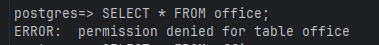

* Створення користувача та ролі

* Створення та заповнення таблиці

* Виконання SELECT без прав на цю команду

* Надання прав на SELECT

* Виконання SELECT з правами на цю команду

* Видалення прав на SELECT

* Виконання SELECT без прав на цю команду

* Виконання UPDATE без прав на цю команду

* Надання прав на UPDATE

* Виконання UPDATE з правами на цю команду

* Виконання DELETE без прав на цю команду

* Надання прав на DELETE

* Виконання DELETE з правами на цю команду

* Вмдалення всіх прав

* Виконання INSERT без прав на цю команду

* Надання прав на INSERT

* Виконання INSERT з правами на цю команду

