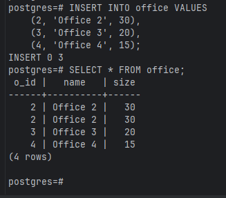
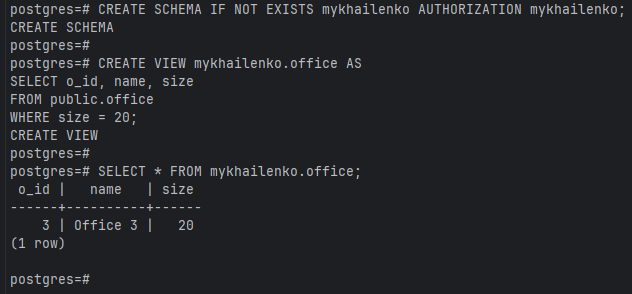
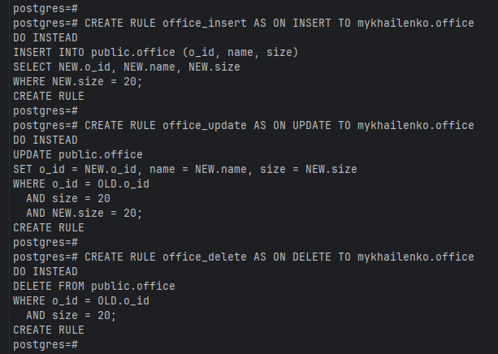
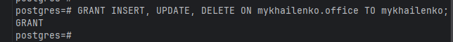
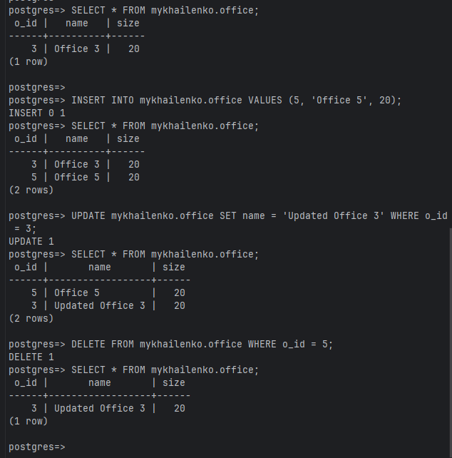

* Додавання ще 3х записів до таблиці

* Створення схеми та view що буде фільтрувати початкову таблицю

* Створення нових правил для INSERT, UPDATE, DELETE

* Надання прав на view

* Перевірка роботи нових правил

