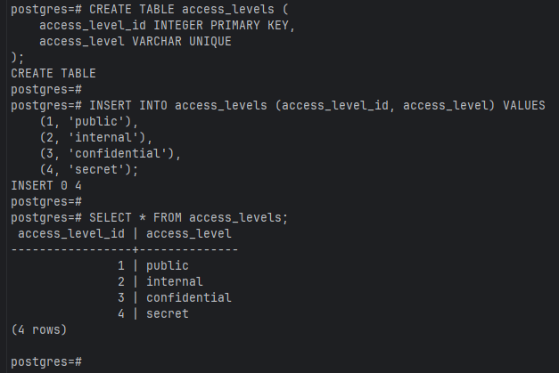
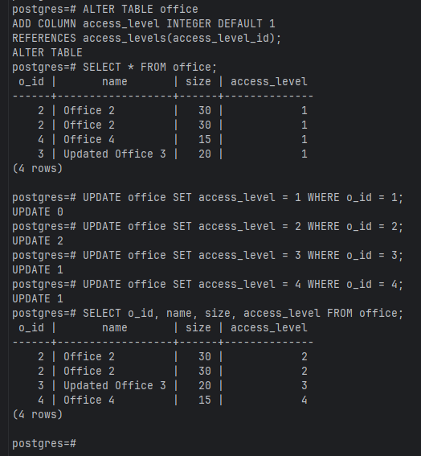
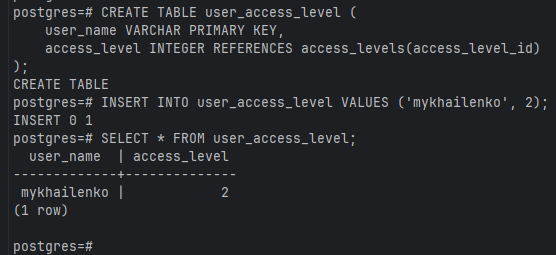
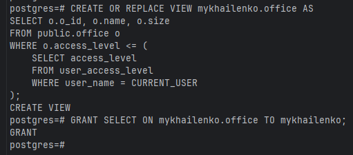
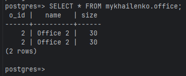
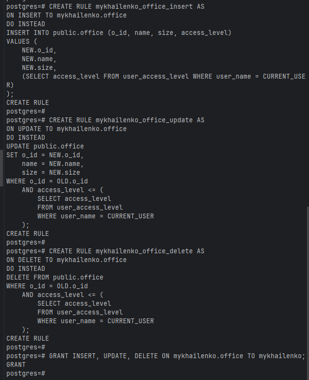
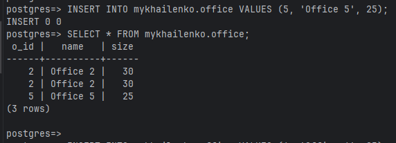
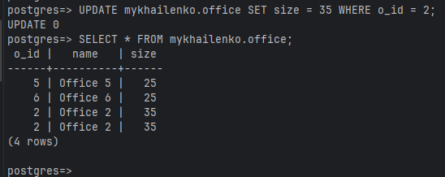
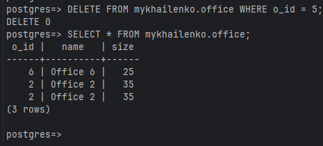

* Створення таблиці для повноважного керування доступом

* Додання нового стовпчика у початкову таблицю та заповння його

* Створення таблиці user_access_level та заповнення її

* Створиння нового view з урахуванням рівня доступу

* Створення правил для view з урахуванням рівня доступу

* Перевірка механізму повноважного керування доступом

